# E-Commerce Frontend

A modern e-commerce frontend application built with React and connected to a Django REST Framework backend.

## Features

### Customer Features

* User registration and authentication
* Browse products by category
* Product search functionality
* Shopping cart management
* Secure checkout process
* Order management
* Payment integration
* Responsive user interface
* Multi-language support
  
### Admin Features

* Product management
* Category management
* Order monitoring
* Content management

## Tech Stack

* React.js
* React Router
* JavaScript
* CSS
* Axios
* Django REST Framework API
* Docker

## Application Structure

```text
src/
├── admin/
├── cart/
├── category_item/
├── create_account/
├── header/
├── home/
├── login/
├── order/
├── payments/
├── search/
└── language/
```

## Screenshots

### Home Page


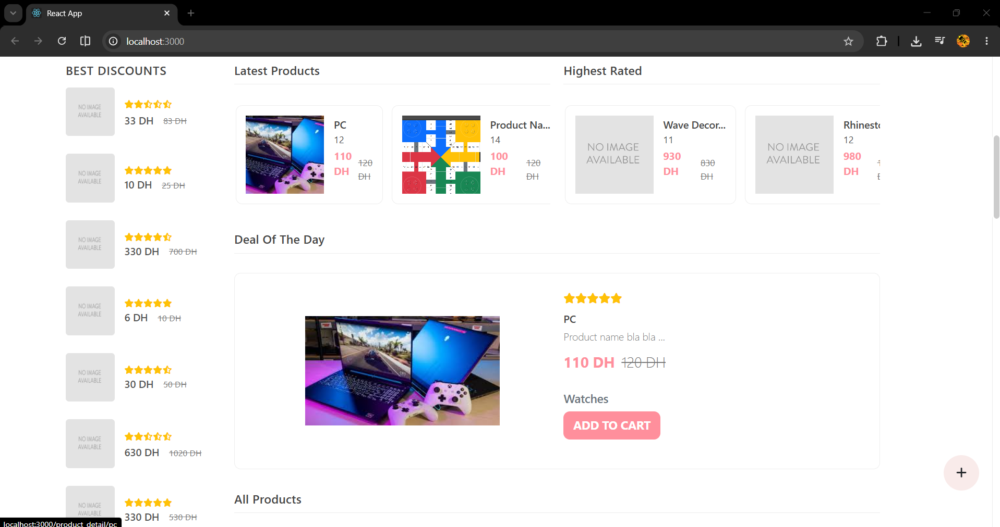

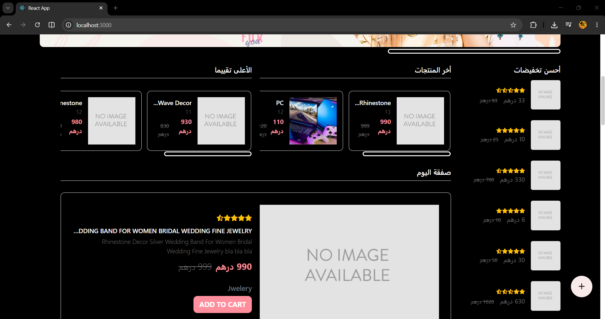

### Product Categories


### Product Details
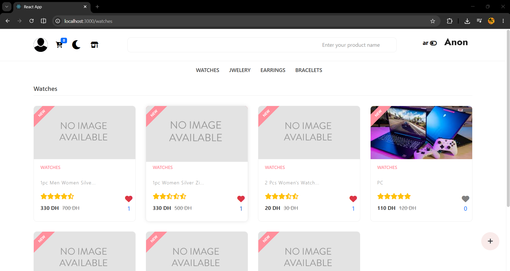
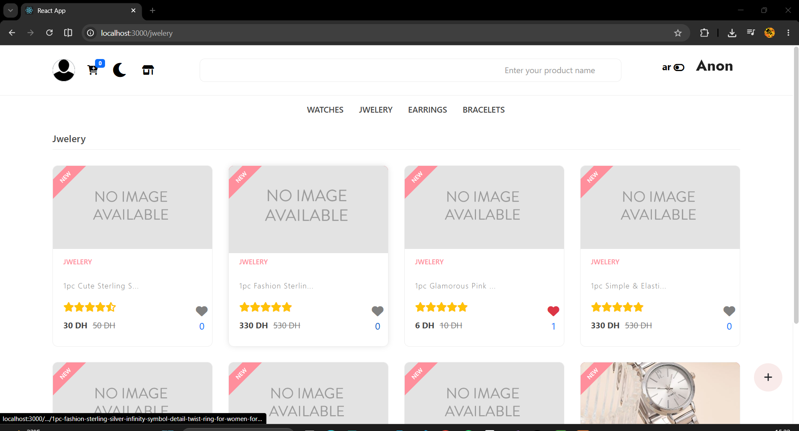
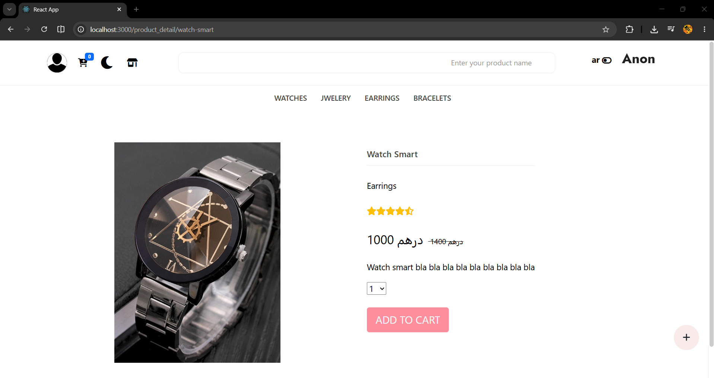


### Shopping Cart
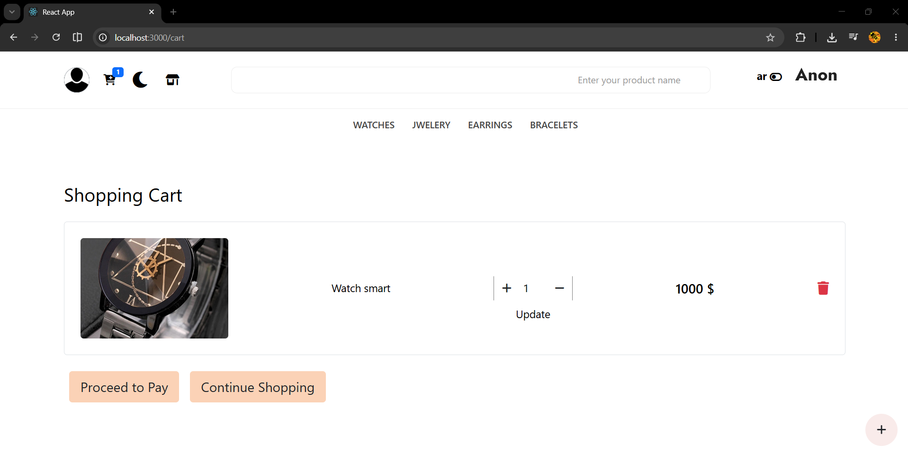


### Your Order
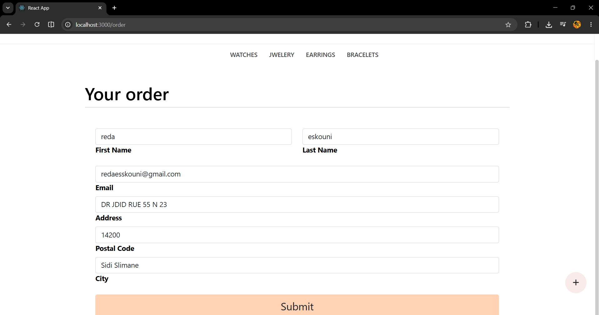

### Checkout


### Payment
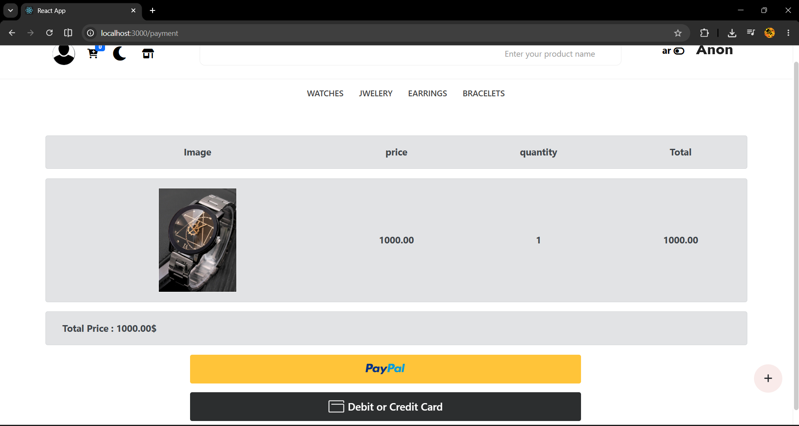
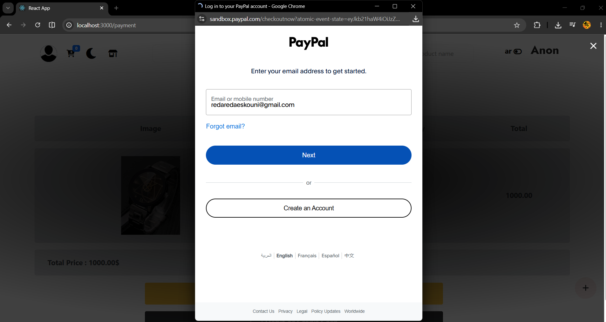

### Login
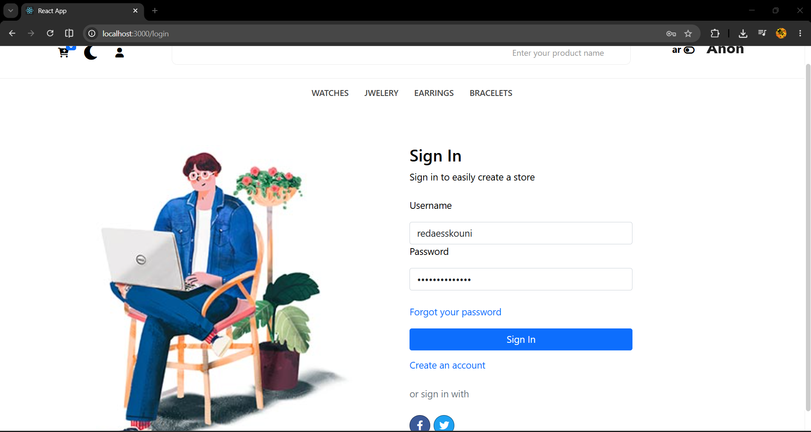

### Create Product
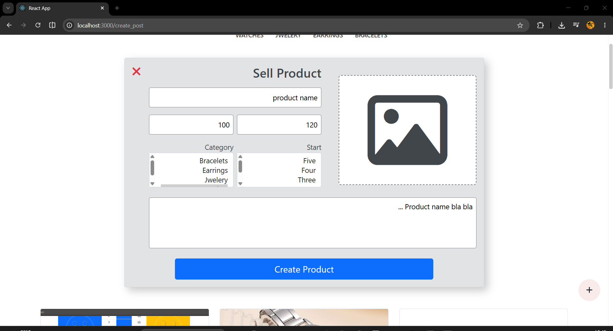

### Admin Dashboard


## Installation

### Clone Repository

```bash
git clone https://github.com/RedaFarissi/front-ecommerce.git
cd front-ecommerce
```

### Install Dependencies

```bash
npm install
```

### Run Development Server

```bash
npm start
```

Application runs on:

```text
http://localhost:3000
```

## Backend Repository

https://github.com/RedaFarissi/back-ecommerce

## Architecture

```text
React Frontend
       │
       ▼
Django REST API
       │
       ▼
SQLite Database
```

## Author

Reda Eskouni
Full Stack Developer
